```mermaid
flowchart TD

    %% ─────────────────────────────────────────────
    %% PHASE 1 — A sale happens
    %% ─────────────────────────────────────────────
    subgraph P1["PHASE 1 · A Sale Happens (Outside DataByt)"]
        direction TB
        A1["🏢 Your client (e.g. a logistics company)\nsells a service or product\nto their own customer (e.g. a retailer)"]
        A2["📄 Finance team opens QuickBooks or Xero\nand creates an Invoice:\n──────────────────────\nInvoice #1042\nTo: Retailer Ltd\nAmount: ₹85,000\nDue: 30 days from today\n──────────────────────"]
        A3["📤 Invoice is 'Sent' to the retailer\nThe 30-day clock starts now"]
        A1 --> A2 --> A3
    end

    %% ─────────────────────────────────────────────
    %% PHASE 2 — DataByt connects
    %% ─────────────────────────────────────────────
    subgraph P2["PHASE 2 · DataByt Reads Your Books (Daily)"]
        direction TB
        B1["🔗 One-time setup:\nYour client clicks 'Connect QuickBooks'\nDataByt gets read access via OAuth\n(like logging in with Google — no password shared)"]
        B2["⏰ Every morning at 8am\nDataByt pulls ALL unpaid invoices\nfrom QuickBooks / Xero automatically"]
        B3["🗄️ DataByt stores them:\n• Who owes money\n• How much\n• How many days overdue\n• Payment history"]
        B1 --> B2 --> B3
    end

    %% ─────────────────────────────────────────────
    %% PHASE 3 — AI scores every invoice
    %% ─────────────────────────────────────────────
    subgraph P3["PHASE 3 · AI Scores Every Overdue Invoice"]
        direction TB
        C1["🤖 AI reads every invoice\nthat is past its due date"]
        C2{{"How many days overdue?"}}
        C3["🟡 L1 · Friendly Reminder\n1–9 days late\n'Hi Sarah, just a heads up...'"]
        C4["🟠 L2 · Firm Follow-up\n10–29 days late\n'This is now overdue. Please arrange payment.'"]
        C5["🔴 L3 · Final Notice\n30+ days late\n'Immediate payment required to avoid escalation.'"]
        C1 --> C2
        C2 -->|"1–9 days"| C3
        C2 -->|"10–29 days"| C4
        C2 -->|"30+ days"| C5
    end

    %% ─────────────────────────────────────────────
    %% PHASE 4 — Email goes out
    %% ─────────────────────────────────────────────
    subgraph P4["PHASE 4 · One Email Per Customer (Not Per Invoice)"]
        direction TB
        D1["✉️ One batched email covers ALL overdue invoices\nfrom that customer in a single message\n(not 5 separate emails for 5 invoices)"]
        D2["📧 Email contains:\n• Customer's real name\n• Each invoice number + amount\n• Total owed\n• A payment link button\n  → goes to YOUR Stripe/Razorpay page"]
        D1 --> D2
    end

    %% ─────────────────────────────────────────────
    %% PHASE 5A — Positive: Customer pays
    %% ─────────────────────────────────────────────
    subgraph P5A["PHASE 5 · ✅ POSITIVE — Customer Pays"]
        direction TB
        E1["📨 Customer receives the email"]
        E2["👆 Clicks the payment link"]
        E3["💳 Pays via Stripe / Razorpay / Bank Transfer\n(whichever link you configured)"]
        E4["✅ You mark invoice as Paid in DataByt\nwith one click"]
        E5["🛑 Collections stop automatically\nNo more emails sent to that customer"]
        E1 --> E2 --> E3 --> E4 --> E5
    end

    %% ─────────────────────────────────────────────
    %% PHASE 5B — Negative: Customer ignores or disputes
    %% ─────────────────────────────────────────────
    subgraph P5B["PHASE 5 · ❌ NEGATIVE — Customer Ignores or Disputes"]
        direction TB
        F1["😶 Customer ignores the email"]
        F2["📅 Next day — invoice still overdue\nAI checks again → escalation level increases"]
        F3["📩 L1 → L2 → L3\nTone gets progressively firmer\nCooldown between emails is respected"]
        F4{{"Customer disputes the invoice?"}}
        F5["🚨 Dispute Filed in DataByt:\n• Collections pause immediately\n• Your team gets notified\n• You investigate in the Disputes dashboard\n• Resolve → collections resume"]
        F6["⚠️ Still no payment after L3\nManual action needed:\ncall the customer / involve legal"]
        F1 --> F2 --> F3 --> F4
        F4 -->|"Yes — disputes"| F5
        F4 -->|"Still ignores"| F6
    end

    %% ─────────────────────────────────────────────
    %% PHASE 6 — You see everything
    %% ─────────────────────────────────────────────
    subgraph P6["PHASE 6 · You (Finance Team) Sees Everything Live"]
        direction TB
        G1["📊 AR Aging Dashboard\nWho owes what · How overdue · Which level"]
        G2["📈 Analytics\nDSO going down · CEI score going up\nEmail open rates · Payment velocity"]
        G3["💰 Cash Flow Forecast\nWhen you expect money to arrive\nbased on current AR buckets"]
        G4["📄 Board PDF Report\nOne click → professional report\nfor CFO / board meeting"]
        G1 --> G2 --> G3 --> G4
    end

    %% ─────────────────────────────────────────────
    %% CONNECT ALL PHASES
    %% ─────────────────────────────────────────────
    P1 --> P2
    P2 --> P3
    P3 --> P4
    P4 --> P5A
    P4 --> P5B
    P5A --> P6
    P5B --> P6

    %% ─────────────────────────────────────────────
    %% STYLES
    %% ─────────────────────────────────────────────
    style P1  fill:#F8FAFC,stroke:#CBD5E1,color:#111
    style P2  fill:#EEF2FF,stroke:#818CF8,color:#111
    style P3  fill:#FFF7ED,stroke:#FB923C,color:#111
    style P4  fill:#F0FDF4,stroke:#4ADE80,color:#111
    style P5A fill:#F0FDF4,stroke:#16A34A,color:#111
    style P5B fill:#FFF1F2,stroke:#F43F5E,color:#111
    style P6  fill:#EEF2FF,stroke:#4F46E5,color:#111
```

# DataByt — How It All Works

> Read top to bottom. Left column = the phase. Right side = what happens.
> ✅ = things go right. ❌ = things go wrong. Both are handled.

---

---

## What is an Invoice? (Absolute Basics)

An invoice is a **bill** one business sends to another.

| Field | Example |
|-------|---------|
| Invoice # | INV-1042 |
| From | DataByt Client (logistics co.) |
| To | Their customer (a retailer) |
| Amount | ₹85,000 |
| For | "Freight services — April 2026" |
| Due date | 30 days from issue |
| Status | Unpaid / Overdue / Paid |

When the retailer is **late paying**, that invoice becomes an **overdue receivable** — money owed that is sitting uncollected. That is what DataByt chases.

---

## What is QuickBooks? (Absolute Basics)

QuickBooks is accounting software — think of it as the financial brain of a business. Finance teams use it to:

- Create and send invoices
- Track who paid and who hasn't
- See their AR aging (how old each unpaid invoice is)
- Generate financial reports

DataByt connects to QuickBooks like a **read-only assistant** — it reads the invoices daily and acts on them. It does not create or modify anything in QuickBooks.

---

## What is DSO?

**Days Sales Outstanding** — how long it takes (on average) to get paid after sending an invoice.

> If you send 100 invoices and customers pay after 60 days on average → your DSO = 60.
> Industry target is 30–45 days. Most mid-market companies are at 60–90 days.
> DataByt's goal: bring your DSO down by ~30%.

---

## Testing It Yourself — Step by Step

Follow these phases in order. Do not skip.

### Step 1 — Log in
Go to `databyt.in/auth` → sign in → you land on the Dashboard.

### Step 2 — Connect an accounting system
Settings → Integrations → Connect QuickBooks (or use the test data that's already seeded).

### Step 3 — See your AR Aging
AR Aging page → you should see a table of invoices with days overdue.

### Step 4 — Trigger a collection email (manually)
Collections page → pick an invoice → click Email → review the AI draft → send.

### Step 5 — Watch the Analytics update
Analytics page → check DSO trend, CEI score, email activity.

### Step 6 — File a dispute
AR Aging → pick an invoice → mark as Disputed → go to Disputes page → resolve it.

### Step 7 — Generate a report
Reports page → Generate PDF → download.

---

*One file. No fluff. Everything else is in the code.*
